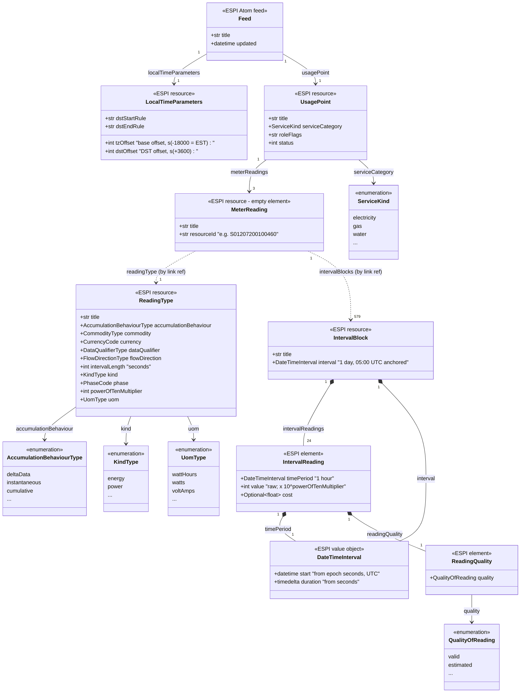

# Toronto Hydro Green Button — Object Model

## Overview

The Toronto Hydro download is an **ESPI (Energy Service Provider Interface) Atom feed**
conforming to the [Green Button](https://www.greenbuttonalliance.org/) standard.
The file is structured as an Atom XML document (namespace `http://www.w3.org/2005/Atom`)
containing `<entry>` elements whose `<content>` holds ESPI resources
(namespace `http://naesb.org/espi`).

The [`greenbutton-objects`](https://pypi.org/project/greenbutton-objects/) Python library
(v2024.7.11) parses this file into a typed object hierarchy. Entry point:

```python
from greenbutton_objects.parse import parse_feed

usage_points = parse_feed("TH_Electric_Usage_23-11-2024_to_24-06-2026.XML")
# usage_points: list[greenbutton_objects.resources.UsagePoint]
```

To reproduce every value quoted in this document, run `uv run explore_model.py`
(the script parses the file with the library **and** performs raw-XML diagnostics
for the DST / `LocalTimeParameters` facts the object model does not expose directly).

---

## Feed structure — entry inventory

The `<feed>` is a flat list of `<entry>` elements. Each entry wraps exactly one ESPI
resource in its `<content>`, and carries Atom `<link>` elements (`rel="self"`,
`rel="up"`, `rel="related"`) that encode the relationships between resources.
Resources are **not** nested in the XML — the object hierarchy is reconstructed from
the `<link>` hrefs and the resource-id tokens embedded in them.

The entries appear in this order. Note that the three series are **interleaved, not
grouped**: each `MeterReading` is immediately followed by its own 579 `IntervalBlock`
entries before the next `MeterReading` begins.

| Order (entry #) | ESPI resource in `<content>` | Count | Notes |
|-----------------|------------------------------|------:|-------|
| 1 | `<espi:LocalTimeParameters>` | 1 | Timezone / DST metadata for local rendering |
| 2 | `<espi:UsagePoint>` | 1 | The metered service point |
| 3–5 | `<espi:ReadingType>` | 3 | One per data series (KWH / KW / KVA) |
| 6 | `<espi:MeterReading>` (KWH) | 1 | **Empty element** — identity comes from links |
| 7 … 585 | `<espi:IntervalBlock>` (KWH) | 579 | The KWH series' daily blocks |
| 586 | `<espi:MeterReading>` (KW) | 1 | **Empty element** |
| 587 … 1165 | `<espi:IntervalBlock>` (KW) | 579 | The KW series' daily blocks |
| 1166 | `<espi:MeterReading>` (KVA) | 1 | **Empty element** |
| 1167 … 1745 | `<espi:IntervalBlock>` (KVA) | 579 | The KVA series' daily blocks |
| (nested) | `<espi:IntervalReading>` | 41,688 | 24 per block; nested inside each IntervalBlock |

Totals: 3 `MeterReading` + 1737 `IntervalBlock` across the three series.

---

## Concrete object instances

### Feed-level metadata

| Field | Value |
|-------|-------|
| Feed title | `"Energy Usage Feed"` |
| File span | 2024-11-23 → 2026-06-24 (579 days ≈ 19 months) |
| Stored timestamps | **Unix epoch seconds, absolute UTC** (see [Time of reading & DST](#time-of-reading--dst-handling)) |
| Local timezone | Described by a separate `LocalTimeParameters` resource: base UTC−5 (EST), +1 h DST |

> **Correction vs. the raw data's appearance:** although the meter is in Toronto
> (Eastern Time, which observes DST), the reading timestamps in the file are **never**
> shifted to UTC−4 in summer. They are absolute UTC epoch integers. DST is a *rendering*
> concern only, handled by the `LocalTimeParameters` resource.

### UsagePoint (1 instance)

| Attribute | Value |
|-----------|-------|
| `title` | `"Meter: Electricity Hourly Usage"` |
| `serviceCategory` | `ServiceKind.electricity` (raw `<espi:kind>0</espi:kind>`) |
| `roleFlags` | `None` |
| `status` | `None` |

### MeterReadings (3 instances — one per data series)

The three series are distinguished by their **`ReadingType`** and by the resource-id
token in their links — **not** by the `MeterReading` element, which is empty in the XML
(`<espi:MeterReading/>`, title `"Meter Reading"` for all three).

| Series (IntervalBlock title) | ReadingType title | Resource id | `kind` | `uom` | `accumulationBehaviour` | `intervalLength` | `powerOfTenMultiplier` | `currency` |
|------------------------------|-------------------|-------------|--------|-------|-------------------------|-----------------|------------------------|-----------|
| Energy Delivered (KWH) | KWH Interval Data | `S01207200100460` | `KindType.energy` | `UomType.wattHours` (Wh) | `deltaData` | 3600 s | −3 | CAD |
| Peak Demand (KW) | KW Interval Data | `S03703800101260` | `KindType.power` | `UomType.watts` (W) | `instantaneous` | 3600 s | −3 | CAD |
| Peak Demand (KVA) | KVA Interval Data | `S01206100101260` | `KindType.energy` | `UomType.voltAmps` (VA) | `instantaneous` | 3600 s | −3 | CAD |

All three share:
`commodity = CommodityType.electricity`, `dataQualifier = DataQualifierType.normal`,
`flowDirection = FlowDirectionType.forward`, `phase = PhaseCode.notApplicable`.

> **Note (source-data quirk):** the KVA series carries `<espi:kind>12</espi:kind>`
> (`KindType.energy`) even though volt-amperes measure *apparent power*. This is how
> Toronto Hydro encoded it; the library faithfully decodes the raw code — it is not a
> parsing error.

### IntervalBlocks & IntervalReadings

| Object | Count (per MeterReading) | Total (3 series) |
|--------|--------------------------|-----------------|
| `IntervalBlock` | 579 | 1737 |
| `IntervalReading` | 13 896 | 41 688 |

- Each **IntervalBlock** spans one 24-hour UTC window (`interval.duration = 86400 s = 1 day`).
- Each **IntervalReading** spans one hour (`timePeriod.duration = 3600 s = 1:00:00`).
- **Exactly 24 IntervalReadings per IntervalBlock, every day** — including the two DST
  transition days (see below). 24 × 579 = 13 896 per series. ✓
- Every IntervalReading has exactly one **ReadingQuality** with `quality = QualityOfReading.valid`.
- `cost` is `None` on all readings (tariff/pricing data not included in this export).

### Sample IntervalReading (first reading, KWH series)

This is the **raw XML** of the first `<espi:IntervalReading>` in the file (inside the
first KWH `IntervalBlock`):

```xml
<espi:IntervalReading>
  <espi:ReadingQuality>
    <espi:quality>0</espi:quality>          <!-- 0 = valid -->
  </espi:ReadingQuality>
  <espi:timePeriod>
    <espi:duration>3600</espi:duration>     <!-- 3600 s = 1 hour -->
    <espi:start>1732338000</espi:start>     <!-- epoch seconds -->
  </espi:timePeriod>
  <espi:value>83759998</espi:value>         <!-- raw integer, x 10^-3 -->
</espi:IntervalReading>
```

Note that the file stores only four leaf values (`quality`, `duration`, `start`, `value`);
everything else is *derived*. The table below maps each raw XML element to its decoded
value and to the corresponding attribute on the library's `IntervalReading` object.
Fields marked *(derived)* have **no** XML element of their own — the library computes them
from `<espi:value>` and the series' `ReadingType`, which is why they cannot be found in
the XML.

| Raw XML element (path) | Raw value | Decoded value | Library attribute |
|------------------------|-----------|---------------|-------------------|
| `<espi:timePeriod>/<espi:start>` | `1732338000` | `2024-11-23 05:00:00+00:00` UTC (= `2024-11-23 00:00:00 EST`) | `timePeriod.start` |
| `<espi:timePeriod>/<espi:duration>` | `3600` | `1:00:00` | `timePeriod.duration` |
| `<espi:value>` | `83759998` | `83759.998` Wh (= raw × 10⁻³ ≈ 83.76 kWh) | `value` |
| *(derived from `ReadingType.uom`)* | — | `UomType.wattHours` | `value_units` |
| *(derived from `ReadingType.uom`)* | — | `"Wh"` | `value_symbol` |
| *(no `<espi:cost>` element present)* | — | `None` | `cost` |
| *(derived from `ReadingType.currency`)* | — | `CurrencyCode.cad` | `cost_units` |
| *(derived from `ReadingType.currency`)* | — | `"$"` | `cost_symbol` |
| `<espi:ReadingQuality>/<espi:quality>` | `0` | `QualityOfReading.valid` | `readingQualities[0].quality` |

> **Units:** the raw ESPI `<espi:value>` integer (`83759998`) is scaled by
> `10^powerOfTenMultiplier` (`10^−3`, from the KWH `ReadingType`) by the library,
> yielding `83759.998` Wh.

---

## The three MeterReading series: XML encoding

Each series is defined by a `ReadingType` entry. The raw ESPI codes and their decoded
meanings are shown below.

| ESPI element | KWH | KW | KVA | Decoded meaning |
|--------------|----:|---:|----:|-----------------|
| `accumulationBehaviour` | `4` | `12` | `12` | 4 = `deltaData`, 12 = `instantaneous` |
| `commodity` | `1` | `1` | `1` | electricity |
| `currency` | `124` | `124` | `124` | CAD (ISO 4217) |
| `dataQualifier` | `12` | `12` | `12` | `normal` |
| `flowDirection` | `1` | `1` | `1` | `forward` |
| `intervalLength` | `3600` | `3600` | `3600` | seconds (1 h) |
| `kind` | `12` | `37` | `12` | 12 = `energy`, 37 = `power` |
| `phase` | `0` | `0` | `0` | `notApplicable` |
| `powerOfTenMultiplier` | `-3` | `-3` | `-3` | ×10⁻³ (milli-) |
| `uom` | `72` | `38` | `61` | 72 = Wh, 38 = W, 61 = VA |

**Example — the KWH `ReadingType` entry (raw XML):**

```xml
<espi:ReadingType xmlns="http://naesb.org/espi" xmlns:espi="http://naesb.org/espi">
  <espi:accumulationBehaviour>4</espi:accumulationBehaviour>   <!-- deltaData -->
  <espi:commodity>1</espi:commodity>                            <!-- electricity -->
  <espi:currency>124</espi:currency>                            <!-- CAD -->
  <espi:dataQualifier>12</espi:dataQualifier>                   <!-- normal -->
  <espi:flowDirection>1</espi:flowDirection>                    <!-- forward -->
  <espi:intervalLength>3600</espi:intervalLength>               <!-- 1 hour -->
  <espi:kind>12</espi:kind>                                     <!-- energy -->
  <espi:phase>0</espi:phase>                                    <!-- notApplicable -->
  <espi:powerOfTenMultiplier>-3</espi:powerOfTenMultiplier>     <!-- x 10^-3 -->
  <espi:uom>72</espi:uom>                                       <!-- Wh -->
</espi:ReadingType>
...
<link rel="self" href=".../resource/ReadingType/S01207200100460" type="espi-entry/ReadingType" />
```

The KW and KVA entries are identical in shape; only `accumulationBehaviour`, `kind`, and
`uom` differ (and their self-link resource ids: `S03703800101260`, `S01206100101260`).

### How an empty MeterReading is tied to its ReadingType and data

The `MeterReading` element carries no fields — the series is assembled entirely from
Atom `<link>` hrefs that share a resource-id token (here `S01207200100460`):

```xml
<content>
  <espi:MeterReading xmlns="http://naesb.org/espi" xmlns:espi="http://naesb.org/espi" />
</content>
...
<link rel="self"    href=".../MeterReading/S01207200100460" type="espi-entry/MeterReading" />
<link rel="related" href=".../MeterReading/S01207200100460/IntervalBlock" type="espi-feed/IntervalBlock" />
<link rel="related" href=".../ReadingType/S01207200100460" type="espi-entry/ReadingType" />
```

- The `rel="related"` `ReadingType` link points at the matching `ReadingType/S01207200100460`.
- The `rel="related"` `IntervalBlock` link points at the collection whose members have
  self-links `.../MeterReading/S01207200100460/IntervalBlock/000001`, `…/000002`, ….

The library follows these hrefs to populate `MeterReading.readingType` and
`MeterReading.intervalBlocks`.

---

## Time of reading & DST handling

### Encoding

Every time value in the file is a **Unix epoch timestamp — an integer count of seconds
since 1970-01-01 00:00:00 UTC**. Both `<espi:start>` (an instant) and `<espi:duration>`
(a length, also in seconds) use this convention. There is no timezone suffix; the value
is absolute UTC.

**Example — the first reading (raw XML) and its decoding:**

```xml
<espi:timePeriod>
  <espi:duration>3600</espi:duration>       <!-- 3600 s = 1 hour -->
  <espi:start>1732338000</espi:start>       <!-- epoch seconds -->
</espi:timePeriod>
```

```
1732338000  ->  2024-11-23 05:00:00 UTC  =  2024-11-23 00:00:00 EST (UTC-5)
```

The library decodes `<espi:start>` into a **timezone-aware `datetime` in UTC**
(`2024-11-23 05:00:00+00:00`) and `<espi:duration>` into a `timedelta` (`1:00:00`).

### Fixed daily grid (no DST re-anchoring)

Every `IntervalBlock` begins at **05:00 UTC = midnight EST**, all year round, and holds
exactly 24 consecutive hourly readings (`interval.duration = 86400 s`). The grid is **not**
re-anchored to local midnight in summer — e.g. a mid-June block also starts at 05:00 UTC,
which is 01:00 local EDT. In effect the file uses a permanent “midnight-EST” day boundary.

Because of this, **both DST-transition days still contain exactly 24 readings** (verified
by `explore_model.py`):

```
2025-03-09 (spring-forward): 24 readings
    first reading : UTC 2025-03-09 05:00 / EST 2025-03-09 00:00
    last  reading : UTC 2025-03-10 04:00 / EST 2025-03-09 23:00
2025-11-02 (fall-back):      24 readings
    first reading : UTC 2025-11-02 05:00 / EST 2025-11-02 00:00
    last  reading : UTC 2025-11-03 04:00 / EST 2025-11-02 23:00
```

### How duplicated / skipped local times are handled

The prompt asks: *if the time of reading is not in UTC, how does the data account for the
duplicated hour when DST rolls back?* **The answer is that the reading time *is* in UTC.**
Because each timestamp is an absolute epoch integer that increases monotonically by 3600,
there is never an ambiguous or missing instant in the file:

- **Fall-back (2025-11-02):** local wall-clock “01:00” occurs twice. In the file these are
  two distinct, unambiguous epochs:

  ```
  epoch 1762059600  ->  UTC 2025-11-02 05:00  ->  local 2025-11-02 01:00 EDT
  epoch 1762063200  ->  UTC 2025-11-02 06:00  ->  local 2025-11-02 01:00 EST
  ```

  Both render as local “01:00”, but the integers differ — no collision, no lost energy.

- **Spring-forward (2025-03-09):** local “02:00” never happens. Again this is only a
  rendering artifact: the epochs run continuously (…04:00 → 05:00 → 06:00 UTC) with no gap.

So duplication/skips only appear when the UTC epochs are *projected onto DST-aware local
wall-clock time*. The stored data itself is unambiguous.

### The LocalTimeParameters resource

The very first entry supplies the metadata a consumer needs to convert UTC → local
wall-clock (and is where DST is actually described):

```xml
<espi:LocalTimeParameters xmlns="http://naesb.org/espi" xmlns:espi="http://naesb.org/espi">
  <espi:dstEndRule>B40E2000</espi:dstEndRule>     <!-- when DST ends (encoded rule) -->
  <espi:dstOffset>3600</espi:dstOffset>           <!-- +1 h during DST -->
  <espi:dstStartRule>360E2000</espi:dstStartRule> <!-- when DST starts (encoded rule) -->
  <espi:tzOffset>-18000</espi:tzOffset>           <!-- base offset -18000 s = -5 h (EST) -->
</espi:LocalTimeParameters>
```

`tzOffset = −18000 s` (UTC−5, EST) is the standard-time base; `dstOffset = 3600 s` is added
during daylight time; `dstStartRule` / `dstEndRule` are packed encodings of the North-American
DST transition rules. This resource is advisory for display — it does not alter the UTC
epoch timestamps on the readings.

---

## Domain model — UML class diagram

This diagram models the **ESPI domain** captured in the file (not the library's Python
classes; those are listed separately below). Solid arrows are containment/associations;
the `MeterReading`↔`ReadingType`↔`IntervalBlock` associations are realized in the XML as
resource-id **link references**, not nesting.



---

## Domain objects → XML sections

| Domain object | Where it lives in the XML |
|---------------|---------------------------|
| `Feed` | The root `<feed>` element (`<id>`, `<title>`, `<updated>`, feed-level `<link>`s). |
| `LocalTimeParameters` | Entry 1: `<content><espi:LocalTimeParameters>` (`dstEndRule`, `dstOffset`, `dstStartRule`, `tzOffset`). |
| `UsagePoint` | Entry 2: `<content><espi:UsagePoint>` with nested `<espi:ServiceCategory><espi:kind>`. Title in the entry's `<title>`. |
| `ReadingType` (×3) | Entries 3–5: `<content><espi:ReadingType>`; each field is a direct child element. Series id in the `rel="self"` link. |
| `MeterReading` (×3) | One entry per series (entries 6, 586, 1166): `<content><espi:MeterReading/>` (empty). Each is immediately followed by its own 579 `IntervalBlock` entries. Reconstructed from `rel="self"` / `rel="related"` links sharing a resource id. |
| `IntervalBlock` (×1737) | One entry each, grouped after their `MeterReading` (579 per series): `<content><espi:IntervalBlock>` containing one `<espi:interval>` and 24 `<espi:IntervalReading>` children. |
| `DateTimeInterval` | `<espi:interval>` (block span) and `<espi:timePeriod>` (reading span): `<espi:start>` (epoch s) + `<espi:duration>` (s). |
| `IntervalReading` | Each `<espi:IntervalReading>` inside a block: `<espi:value>` (raw int) + nested `<espi:timePeriod>` and `<espi:ReadingQuality>`. |
| `ReadingQuality` | `<espi:ReadingQuality><espi:quality>` nested in each reading. |

---

## Python / library view (`greenbutton-objects` v2024.7.11)

The library flattens the ESPI resources into the object tree returned by `parse_feed`.

### ESPI XML → Python object mapping

| ESPI XML | Python class | Python attribute |
|----------|--------------|------------------|
| `<feed>` (Atom root) | `parse_feed()` result | `list[UsagePoint]` |
| `<espi:LocalTimeParameters>` | *(not exposed on the object tree)* | — |
| `<espi:UsagePoint>` | `resources.UsagePoint` | — |
| `<espi:ServiceCategory><espi:kind>` | `enums.ServiceKind` | `UsagePoint.serviceCategory` |
| `<espi:MeterReading>` (empty) + links | `resources.MeterReading` | `UsagePoint.meterReadings` |
| `<espi:ReadingType>` | `resources.ReadingType` | `MeterReading.readingType` |
| `<espi:uom>` | `enums.UomType` | `ReadingType.uom` |
| `<espi:powerOfTenMultiplier>` | `int` | `ReadingType.powerOfTenMultiplier` |
| `<espi:intervalLength>` | `int` (seconds) | `ReadingType.intervalLength` |
| `<espi:accumulationBehaviour>` | `enums.AccumulationBehaviourType` | `ReadingType.accumulationBehaviour` |
| `<espi:kind>` (ReadingType) | `enums.KindType` | `ReadingType.kind` |
| `<espi:IntervalBlock>` | `resources.IntervalBlock` | `MeterReading.intervalBlocks` |
| `<espi:interval>` | `objects.DateTimeInterval` | `IntervalBlock.interval` |
| `<espi:IntervalReading>` | `objects.IntervalReading` | `IntervalBlock.intervalReadings` |
| `<espi:timePeriod>` | `objects.DateTimeInterval` | `IntervalReading.timePeriod` |
| `<espi:start>` (epoch **seconds**, int) | `datetime` (aware, **UTC**) | `DateTimeInterval.start` |
| `<espi:duration>` (**seconds**, int) | `timedelta` | `DateTimeInterval.duration` |
| `<espi:value>` × 10^`powerOfTenMultiplier` | `float` | `IntervalReading.value` |
| `<espi:cost>` (absent here) | `Optional[float]` (→ `None`) | `IntervalReading.cost` |
| `<espi:ReadingQuality>` | `objects.ReadingQuality` | `IntervalReading.readingQualities` |
| `<espi:quality>` | `enums.QualityOfReading` | `ReadingQuality.quality` |

### Module reference

| Module | Contents |
|--------|----------|
| `greenbutton_objects.parse` | `parse_feed(filename: str) -> list[UsagePoint]` |
| `greenbutton_objects.resources` | `Resource`, `UsagePoint`, `MeterReading`, `ReadingType`, `IntervalBlock` |
| `greenbutton_objects.objects` | `DateTimeInterval`, `IntervalReading`, `ReadingQuality` |
| `greenbutton_objects.enums` | `ServiceKind`, `AccumulationBehaviourType`, `CommodityType`, `CurrencyCode`, `DataQualifierType`, `FlowDirectionType`, `KindType`, `PhaseCode`, `UomType`, `QualityOfReading`, `ConsumptionTierType`, `TimeAttributeType` |
