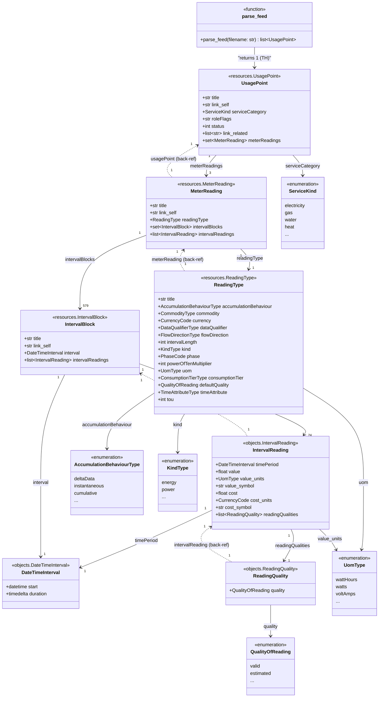

# Toronto Hydro Green Button — Object Model

## Overview

The Toronto Hydro download is an **ESPI (Energy Service Provider Interface) Atom feed**
conforming to the [Green Button](https://www.greenbuttonalliance.org/) standard.
The file is structured as an Atom XML document (namespace `http://www.w3.org/2005/Atom`)
containing `<entry>` elements whose `<content>` holds ESPI resources
(namespace `http://naesb.org/espi`).

The [`greenbutton-objects`](https://pypi.org/project/greenbutton-objects/) Python library
(v2024.7.11) parses this file into a typed object hierarchy.
Entry point:

```python
from greenbutton_objects.parse import parse_feed

usage_points = parse_feed("TH_Electric_Usage_23-11-2024_to_24-06-2026.XML")
# usage_points: list[greenbutton_objects.resources.UsagePoint]
```

---

## Toronto Hydro — Concrete Object Instances

### Feed-level metadata

| Field | Value |
|-------|-------|
| File span | 2024-11-23 → 2026-06-24 (≈ 19 months) |
| Timezone | EST (UTC−5), DST applies (UTC−4 in summer) |
| DST rules | North America standard |

### UsagePoint (1 instance)

| Attribute | Value |
|-----------|-------|
| `title` | `"Meter: Electricity Hourly Usage"` |
| `serviceCategory` | `ServiceKind.electricity` |
| `roleFlags` | `None` |
| `status` | `None` |

### MeterReadings (3 instances — one per data series)

| Series | ReadingType title | `kind` | `uom` | `accumulationBehaviour` | `intervalLength` | `powerOfTenMultiplier` | `currency` |
|--------|------------------|--------|-------|------------------------|-----------------|----------------------|-----------|
| Energy Delivered | KWH Interval Data | `KindType.energy` | `UomType.wattHours` (Wh) | `deltaData` | 3600 s | −3 | CAD |
| Peak Demand | KW Interval Data | `KindType.power` | `UomType.watts` (W) | `instantaneous` | 3600 s | −3 | CAD |
| Peak Demand | KVA Interval Data | `KindType.energy` | `UomType.voltAmps` (VA) | `instantaneous` | 3600 s | −3 | CAD |

All three share:
`commodity = CommodityType.electricity`, `dataQualifier = DataQualifierType.normal`,
`flowDirection = FlowDirectionType.forward`, `phase = PhaseCode.notApplicable`.

### IntervalBlocks & IntervalReadings

| Object | Count (per MeterReading) | Total (3 series) |
|--------|--------------------------|-----------------|
| `IntervalBlock` | 579 | 1737 |
| `IntervalReading` | 13 896 | 41 688 |

- Each **IntervalBlock** spans one calendar day (`interval.duration = 1 day`).
- Each **IntervalReading** spans one hour (`timePeriod.duration = 1:00:00`).
- 24 IntervalReadings per IntervalBlock × 579 blocks = 13 896 per series. ✓
- Every IntervalReading has exactly one **ReadingQuality** with `quality = QualityOfReading.valid`.
- `cost` is `None` on all readings (tariff/pricing data not included in this export).

### Sample IntervalReading (first reading, KWH series)

| Field | Value |
|-------|-------|
| `timePeriod.start` | `2024-11-23 05:00:00 UTC` (= 2024-11-23 00:00:00 EST) |
| `timePeriod.duration` | `1:00:00` |
| `value` | `83759.998` Wh (≈ 83.76 kWh) |
| `value_units` | `UomType.wattHours` |
| `value_symbol` | `"Wh"` |
| `cost_symbol` | `"$"` |
| `cost_units` | `CurrencyCode.cad` |
| `readingQualities[0].quality` | `QualityOfReading.valid` |

> **Note on units**: raw ESPI `<value>` integers (e.g. `83759998`) are scaled by
> `10^powerOfTenMultiplier` (`10^−3`) by the library, yielding `83759.998` Wh.


# UML Class Diagram



---

## ESPI XML → Python Object Mapping

| ESPI XML element | Python class | Python attribute |
|------------------|-------------|-----------------|
| `<feed>` (Atom root) | `parse_feed()` result | `list[UsagePoint]` |
| `<entry>` / `<espi:UsagePoint>` | `resources.UsagePoint` | — |
| `<espi:ServiceCategory><espi:kind>` | `enums.ServiceKind` | `UsagePoint.serviceCategory` |
| `<entry>` / `<espi:MeterReading>` | `resources.MeterReading` | `UsagePoint.meterReadings` |
| `<entry>` / `<espi:ReadingType>` | `resources.ReadingType` | `MeterReading.readingType` |
| `<espi:uom>` | `enums.UomType` | `ReadingType.uom` |
| `<espi:powerOfTenMultiplier>` | `int` | `ReadingType.powerOfTenMultiplier` |
| `<espi:intervalLength>` | `int` (seconds) | `ReadingType.intervalLength` |
| `<espi:accumulationBehaviour>` | `enums.AccumulationBehaviourType` | `ReadingType.accumulationBehaviour` |
| `<espi:kind>` | `enums.KindType` | `ReadingType.kind` |
| `<entry>` / `<espi:IntervalBlock>` | `resources.IntervalBlock` | `MeterReading.intervalBlocks` |
| `<espi:interval>` | `objects.DateTimeInterval` | `IntervalBlock.interval` |
| `<espi:IntervalReading>` | `objects.IntervalReading` | `IntervalBlock.intervalReadings` |
| `<espi:timePeriod>` | `objects.DateTimeInterval` | `IntervalReading.timePeriod` |
| `<espi:start>` | `datetime` (UTC) | `DateTimeInterval.start` |
| `<espi:duration>` | `timedelta` | `DateTimeInterval.duration` |
| `<espi:value>` × 10^`powerOfTenMultiplier` | `float` | `IntervalReading.value` |
| `<espi:cost>` | `Optional[float]` | `IntervalReading.cost` |
| `<espi:ReadingQuality>` | `objects.ReadingQuality` | `IntervalReading.readingQualities` |
| `<espi:quality>` | `enums.QualityOfReading` | `ReadingQuality.quality` |

---

## Module Reference (`greenbutton-objects` v2024.7.11)

| Module | Contents |
|--------|----------|
| `greenbutton_objects.parse` | `parse_feed(filename: str) -> list[UsagePoint]` |
| `greenbutton_objects.resources` | `Resource`, `UsagePoint`, `MeterReading`, `ReadingType`, `IntervalBlock` |
| `greenbutton_objects.objects` | `DateTimeInterval`, `IntervalReading`, `ReadingQuality` |
| `greenbutton_objects.enums` | `ServiceKind`, `AccumulationBehaviourType`, `CommodityType`, `CurrencyCode`, `DataQualifierType`, `FlowDirectionType`, `KindType`, `PhaseCode`, `UomType`, `QualityOfReading`, `ConsumptionTierType`, `TimeAttributeType` |
